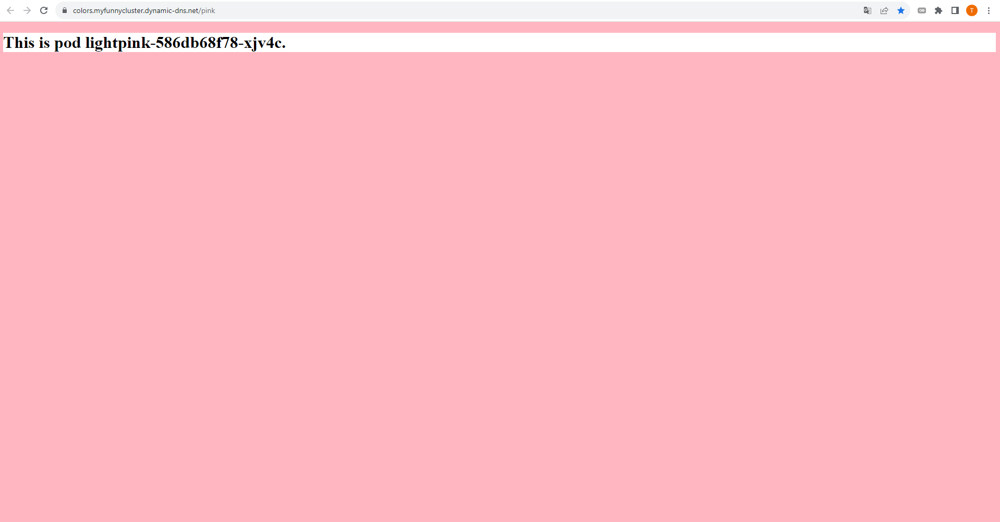

# myfunnycluster

My repository for gitops linked with [Argo cd](https://github.com/argoproj/argo-cd) on my hybrid cloud with kubes ([k3s](https://k3s.io/)) :) 

Everything secure in https with [traefik](https://traefik.io/traefik/) as proxy + [cert-manager](https://cert-manager.io/) as issuer + [Let's Encrypt](https://letsencrypt.org/) as C.A

## colors-webapp

A simple node app that show pod id with background color of pod name :

## firefly-iii

[Firefly III]((https://www.firefly-iii.org/)): a personal finances manager

